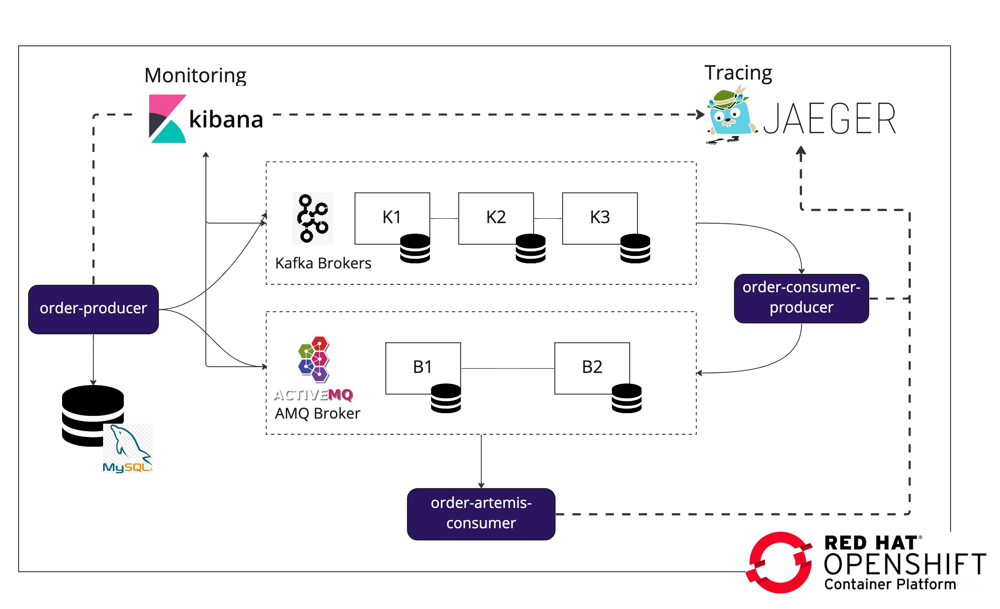
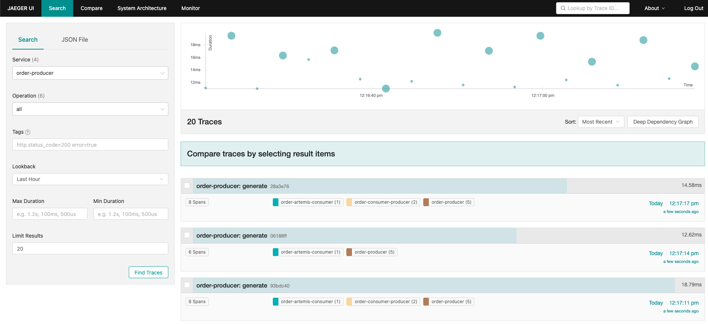
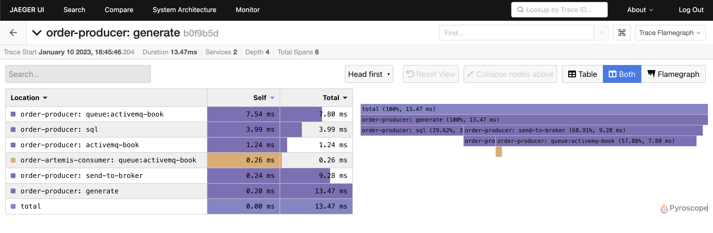
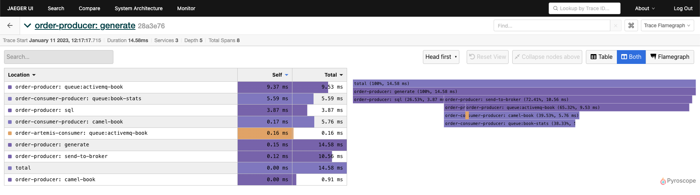
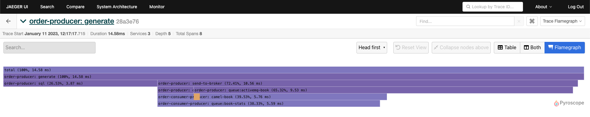
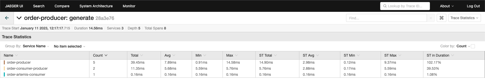
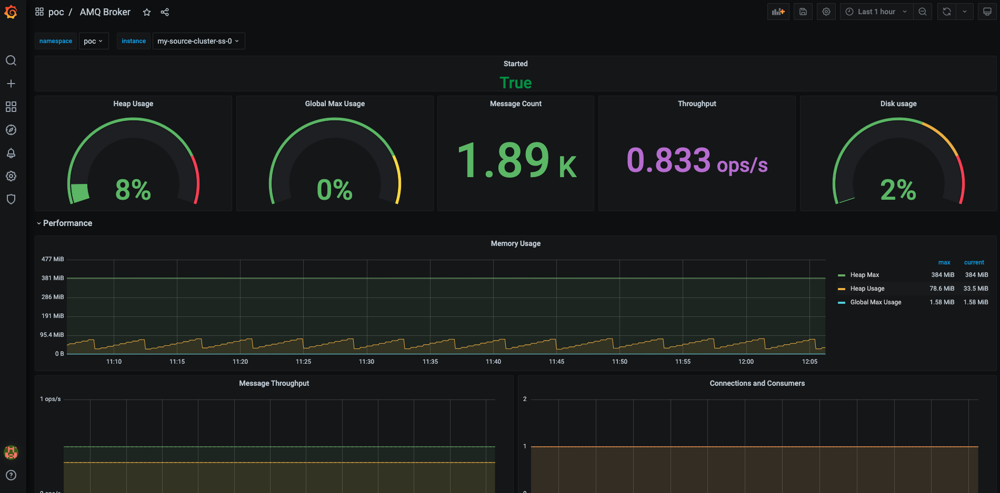
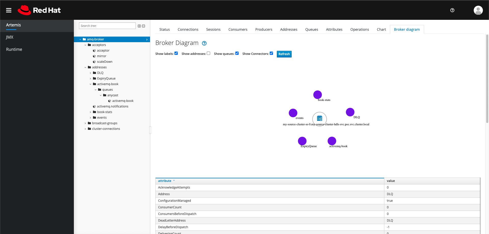
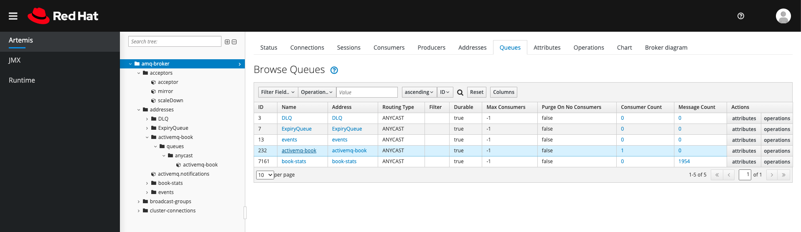
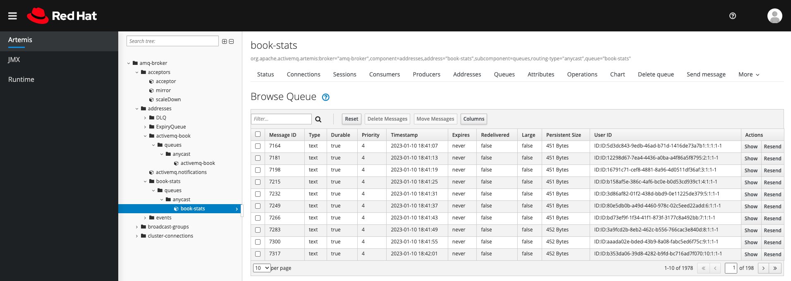

= Obversability with Camel Quarkus Artemis and Kafka

This project aims to use Apache Camel to send and consume events from Artemis message broker, capture the tracing information and display it in Jaeger. 

Also it has monitoring dashboard for Artemis.

Component architecture:



* order-producer

Each 3s save order to a MYSQL database and send the message to Kafka `camel-book`,  `activemq-book` topic and `activemq-book` and `camel-book` queue in Artemis.

* order-artemis-consumer

Consume messages from `activemq-book` and `camel-book` queue in Artemis. 


== Tracing with multiple applications.

Overall tracing



Tracing detail

image::img/tracing.png[]

Tracing FlameGraph







Tracing Statistics



== Monitoring

Grafana collect metrics from prometheus and make it available through dashboards.

AMQ Broker (Artemis) dashboard



== Other toolings

AMQ Console 








== Security 

https://docs.redhat.com/en/documentation/red_hat_amq_broker/7.12/html-single/deploying_amq_broker_on_openshift/index#assembly-br-configuring-security-operator_broker-ocp[Official documentation.]

By default, AMQ Broker uses a Java Authentication and Authorization Service (JAAS) properties login module to authenticate and authorize users. The configuration for the default JAAS login module is stored in a /home/jboss/amq-broker/etc/login.config file on each broker Pod and reads user and role information from the artemis-users.properties and artemis-roles.properties files in the same directory. You add the user and role information to the properties files in the default login module by updating the ActiveMQArtemisSecurity Custom Resource (CR).

An alternative to updating the ActiveMQArtemisSecurity CR to add user and role information to the default properties files is to configure one or more JAAS login modules in a secret. This secret is mounted as a file on each broker Pod. Configuring JAAS login modules in a secret offers the following advantages over using the ActiveMQArtemisSecurity CR to add user and role information.

== Pre requirements

. JDK 11+
. Quarkus CLI
. Docker
. AMQ Broker Operator
. AMQ Grafana Operator
. Red Hat OpenShift distributed tracing platform

== Local development

. Init AMQ, Jaeger: `docker compose up`
. Artemis Console: ``` http://localhost:8161/console/ ```
. Jaeger Console: ```http://localhost:16686/search```  

To run the apps: 

Inside each project:

    quarkus dev

=== Generating application images

Inside the order-artemis-consumer directory

    mvn clean package
    docker build -f src/main/docker/Dockerfile.jvm -t order-artemis-consumer .
    docker tag order-artemis-consumer quay.io/hodrigohamalho/activemq-quarkus-tracing:order-artemis-consumer
    docker push quay.io/hodrigohamalho/activemq-quarkus-tracing:order-artemis-consumer

Inside the order-producer directory

    mvn clean package
    docker build -f src/main/docker/Dockerfile.jvm -t order-producer .
    docker tag order-producer quay.io/hodrigohamalho/activemq-quarkus-tracing:order-producer
    docker push quay.io/hodrigohamalho/activemq-quarkus-tracing:order-producer

== Install the demo in Openshift with Ansible

Install the following operators before running the playbooks:

. AMQ Broker Operator
. AMQ Grafana Operator
. Red Hat OpenShift distributed tracing platform

NOTE: I decided to remove Operators logic from the playbooks because it looks to broke whenever there is a new version of a Operator the playbooks starts to fail (It's annoying).

=== Parameters

[options="header"]
|=======================
| Parameter      | Example Value                                      | Definition
| tkn     | sha256~vFanQbthlPKfsaldJT3bdLXIyEkd7ypO_XPygY1DNtQ | access token for a user with cluster-admin privileges
| server    | https://api.mycluster.opentlc.com:6443             | OpenShift Cluster API URL
|=======================

=== Deploying the demo

    export tkn=sha256~G5Oiebe1egoNhEqcVLR89M1D_ZhMqA_vx_n434StzrI
    export server=https://api.cluster-dgpkx.dgpkx.sandbox2178.opentlc.com:6443
    ansible-playbook -e token=${tkn} -e server=${server} playbook.yml


=== External Access 

Step 1: Create the broker keystore

Note that I'm using the Java Keytool to generate the necessary certificates and stores for this example. First, generate a self-signed certificate for the broker keystore. When asked for a password, use password:

    $ keytool -genkey -alias broker -keyalg RSA -keystore broker.ks

Next, export the certificate so that it can be shared with clients:

    $ keytool -export -alias broker -keystore broker.ks -file broker_cert

Create a client truststore that imports the broker certificate:

    $ keytool -import -alias broker -keystore client.ts -file broker_cert

Generate a self-signed certificate for the broker trust store:

    $ keytool -genkey -alias broker -keyalg RSA -keystore broker.ts

Note: When you import the broker_cert make sure that you specify yes to the dialog: Trust this certificate? [no]:  yes. The default setting is no.

Create the `amq-poc-tls` secret:

    oc create secret generic amq-poc-tls \
    --from-file=broker.ks \
    --from-literal=keyStorePassword=password \
    --from-file=client.ts=broker.ts \
    --from-literal=trustStorePassword=password

Let's try to check if the connection is working, connecting to the HOST:

Export the variables acording with your setup:

    URL=amqps://my-source-cluster-acceptor-0-svc-rte-poc.apps.cluster-2hr77.2hr77.sandbox2997.opentlc.com:443
    USER=admin
    PASS=admin
    TS_LOCATION=/Users/rramalho/coding/artemis-showcase/ansible/roles/amq-broker/files/client.ts
    TS_PASSWORD=password
    VERIFYHOST=false

Do the connection using the Artemis CLI tool:

    artemis producer --url "$URL?jms.username=$USER&jms.password=$PASS&transport.trustStoreLocation=$TS_LOCATION&transport.trustStorePassword=$TS_PASSWORD&transport.verifyHost=false" --threads 1 --protocol amqp --message-count 10 --destination 'queue://tecban.foo'

Consuming Messages:

    artemis consumer --url "$URL?jms.username=$USER&jms.password=$PASS&transport.trustStoreLocation=$TS_LOCATION&transport.trustStorePassword=$TS_PASSWORD&transport.verifyHost=false"  --threads 1 --protocol amqp --message-count 10 --destination 'queue://tecban.foo'
